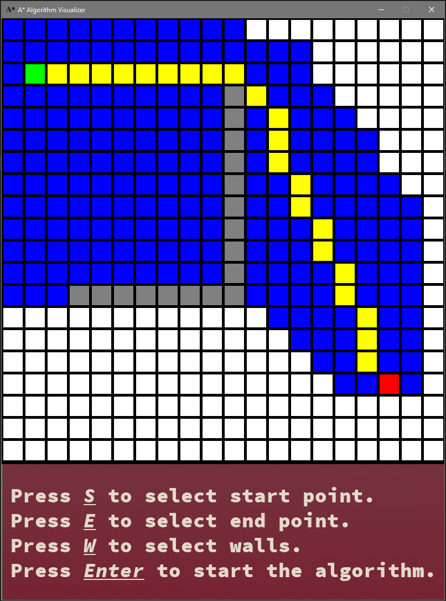

# A-Star-Algorithm-Visualizer

Gui that visualizes the A* pathfinding algorithm  

## Description
This projects visualizes the pathfinding algorithm A* using a grid. It uses Pygame for the window and user input. The algorithm is implemented using a Priority Queue and is guaranteed to find the shortest path if there is one.

## Usage
1. Run the program.
2. Press S to select a start point.
3. Press E to select an ending point.
4. Press W to select any amount of walls.
5. Press Enter to see the algorithm run.

## Technologies Used
Python, pygame, Priority Queues

## Improvements
 - Clean up some messy code.
 - Make sure variables and functions are named properly.

## References

[Wikipedia](https://en.wikipedia.org/wiki/A*_search_algorithm)\
[Red Blob Games](https://www.redblobgames.com/pathfinding/a-star/implementation.html)\
[Towards Data Science](https://towardsdatascience.com/priority-queues-in-python-3baf0bac2097)

## License

This project is licensed under the  MIT License - see the LICENSE file for details.
